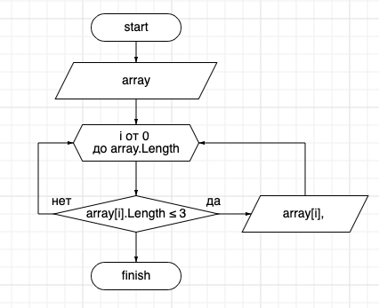

# Итоговая проверочная работа
## Базовое знакомство с IT
 
**Задача**: Написать программу, которая из имеющегося массива строк формирует массив из строк, длина которых меньше либо равна 3 символам

**Алгоритм решения**:

1. Запросить у пользователя текст и пеобразовать его в строку.
2. Разделить текст по словам и создать массив строк.
3. Написать метод, выбирающий слова из 3-х и менее символов.
4. Использовать метод на нашем массиве строк.

Метод в виде блок-схемы

